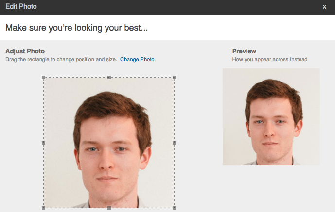
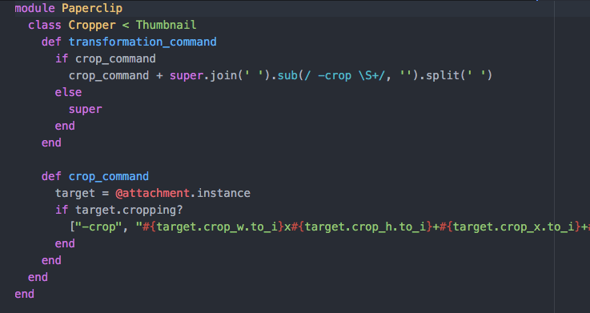

# Instead

Instead is a job search and professional profile management site.  When complete, users will be able to

-Create a personal profile
-Create a business profile
-Post jobs and respond to postings
-Make connections with other users
-Receive notifications
-Create resumes based on entered information

## Technical

Right now, I'm working on an avatar cropper.  The front-end uses jCrop to determine the correct coordinates of the cropped image.

On the back-end, a custom processor extends the thumbnail processor for cropping.

